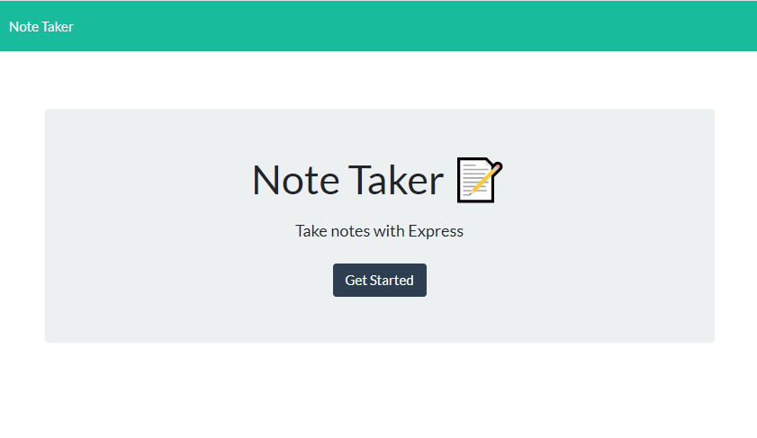
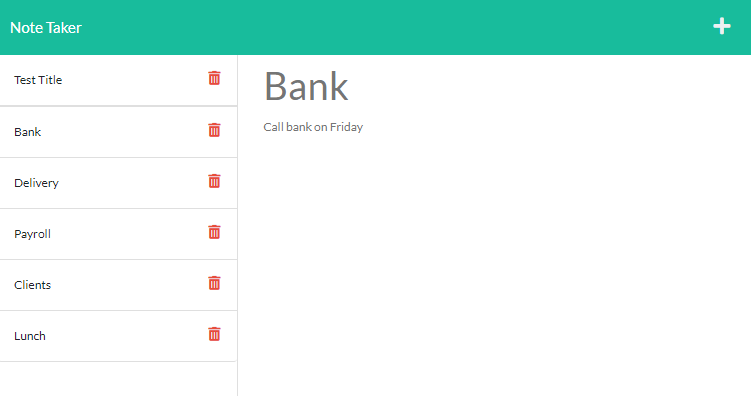

 
  # A Note Creator

  # Table of Contents
  _________________________________

[Description](#Description)

[Installations](#Installations)

[Usage](#Usage)

[Credits](#Credits)

[License](#License)

[Test](#Test)

[Questions](#Questions)
 

  # Description
   AS A small business owner I WANT to be able to write and save notes SO that I can orginize m thoughts and keep track of the tasks I need to complete. WHEN  I enter a new note and title, then the save button appears, THEN when I click in that button I can save my note.

  # Installation
    fs, express, path, uuidv4

  # Usage
  All you need to do is open the app from Heroku, then you can see the app and write your notes. 

  # Credits
  none

  # License
  
  
  # Test
  none

  # Questions
  _________________________________

  ## If you have any further questions about this project, you can always contact me here:(Click Enter)

  ## Autor
  Fabiola C. Gamboa

  ## [Github](https://github.com/Fabskickass)
  

  ## [Email](fabiscg79@gmail.com)
  ___________________________________________

  ## 

  ## 

  

  
